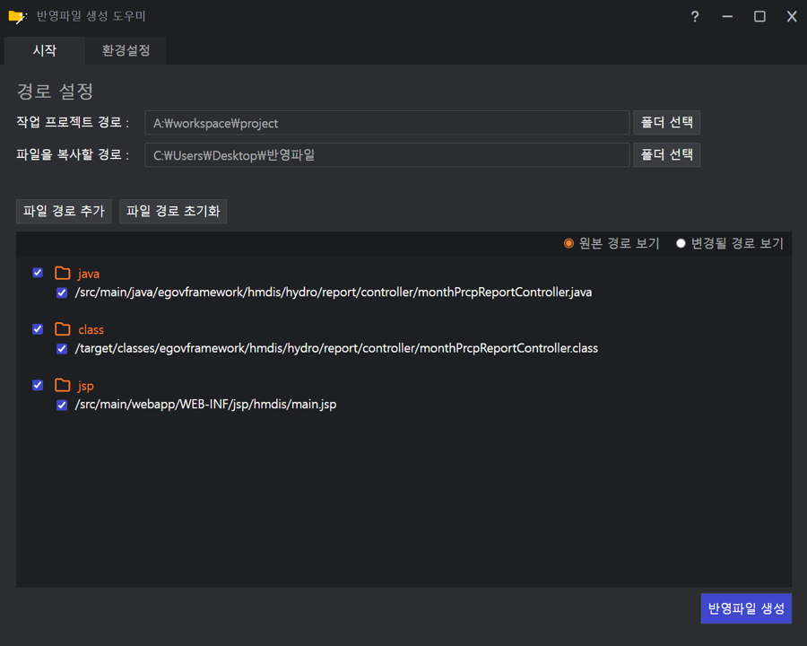

# patch_file_builder

배포 자동화 파이프라인 구성이 어려운 환경에서 수정한 파일의 반영을 도와주는 프로그램 입니다.<br>
수정한 파일의 추출, 백업, 반영을 자동화합니다.



### 자세한 사용법은 블로그를 참고해주세요.
https://bom-b.tistory.com/45

---

## 프로젝트 정보

### 기술 스택
| 분류         | 기술         |
|------------|------------|
| Frontend   | Vue.js     |
| Desktop    | Electron   |
| Build Tool | Vite       |
| Language   | JavaScript |

### 개발 명령어
node module 다운로드
```sh
yarn install
```

vue 실행

```sh
yarn run dev
```

electron 실행

```sh
yarn run electron:serve
```
